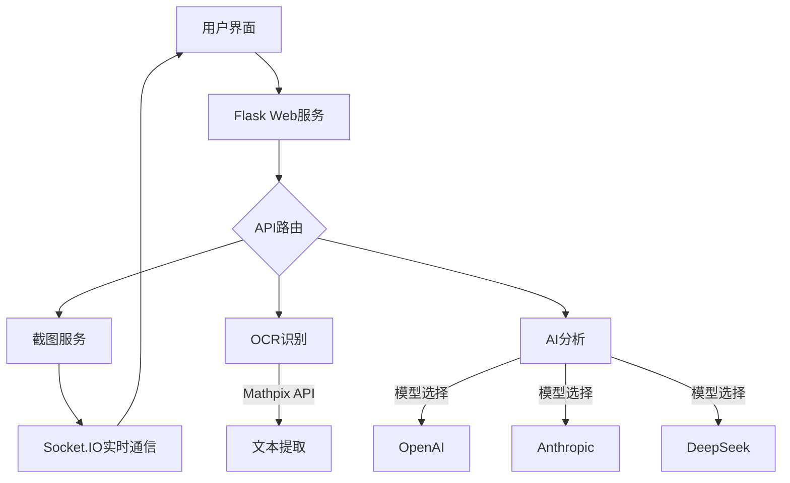

<h1 align="center">Snap-Solver </h1>


<p align="center">
  <b>🔍 一键截屏，自动解题 - 线上考试，从未如此简单</b>
</p>

<p align="center">
  
  
  
  
</p>


<p align="center">
  <a href="#-核心特性">核心特性</a> •
  <a href="#-快速开始">快速开始</a> •
  <a href="#-使用指南">使用指南</a> •
  <a href="#-技术架构">技术架构</a> •
  <a href="#-高级配置">高级配置</a> •
  <a href="#-常见问题">常见问题</a> •
  <a href="#-获取帮助">获取帮助</a>
</p>

<p align="center">
  
</p>

## 💫 项目简介

**Snap-Solver** 是一个革命性的AI笔试测评工具，专为学生、考生和自学者设计。只需**按下快捷键**，即可自动截取屏幕上的任何题目，通过AI进行分析并提供详细解答。

无论是复杂的数学公式、物理难题、编程问题，还是其他学科的挑战，Snap-Solver都能提供清晰、准确、有条理的解决方案，帮助您更好地理解和掌握知识点。

<div align="center">
  <table>
    <tr>
      <td align="center" style="background-color: #f8f9fa; padding: 10px; border-radius: 5px;">
        <b>📞 代部署支持</b><br>
        如果您不擅长编程，需要专业的代部署服务<br>
        请联系：<a href="mailto:zylanjian@outlook.com">zylanjian@outlook.com</a>
      </td>
    </tr>
  </table>
</div>

## ✨ 核心特性

<table>
  <tr>
    <td width="50%">
      <h3>📱 跨设备协同</h3>
      <ul>
        <li><b>一键截图</b>：按下快捷键，即可在移动设备上查看和分析电脑屏幕</li>
        <li><b>局域网共享</b>：一处部署，多设备访问，提升学习效率</li>
      </ul>
    </td>
    <td width="50%">
      <h3>🧠 多模型AI支持</h3>
      <ul>
        <li><b>GPT-4o/o3-mini</b>：OpenAI强大的推理能力</li>
        <li><b>Claude-3.7</b>：Anthropic的高级理解与解释</li>
        <li><b>DeepSeek-v3/r1</b>：专为中文场景优化的模型</li>
      </ul>
    </td>
  </tr>
  <tr>
    <td>
      <h3>🔍 精准识别</h3>
      <ul>
        <li><b>OCR文字识别</b>：准确捕捉图片中的文本</li>
        <li><b>数学公式支持</b>：通过Mathpix精确识别复杂数学符号</li>
      </ul>
    </td>
    <td>
      <h3>🌐 全球无障碍</h3>
      <ul>
        <li><b>VPN代理支持</b>：自定义代理设置，解决网络访问限制</li>
        <li><b>多语言响应</b>：支持定制AI回复语言</li>
      </ul>
    </td>
  </tr>
  <tr>
    <td>
      <h3>💻 全平台兼容</h3>
      <ul>
        <li><b>桌面支持</b>：Windows、MacOS、Linux</li>
        <li><b>移动访问</b>：手机、平板通过浏览器直接使用</li>
      </ul>
    </td>
    <td>
      <h3>⚙️ 高度可定制</h3>
      <ul>
        <li><b>思考深度控制</b>：调整AI的分析深度</li>
        <li><b>自定义提示词</b>：针对特定学科优化提示</li>
      </ul>
    </td>
  </tr>
</table>

## 🚀 快速开始

### 📋 前置要求

- Python 3.x
- 至少以下一个API Key（详见[获取API密钥指南](#-获取api密钥)）:
  - OpenAI API Key
  - Anthropic API Key (推荐✅)
  - DeepSeek API Key
  - Mathpix API Key (推荐OCR识别✅)

### 📥 开始使用

```bash
# 启动应用
python app.py
```

### 📱 访问方式

- **本机访问**：打开浏览器，访问 http://localhost:5000
- **局域网设备访问**：在同一网络的任何设备上访问 `http://[电脑IP]:5000`

## 📖 使用指南

<table>
  <tr>
    <td width="33%">
      <h4>1️⃣ 首次配置</h4>
      <p>点击右上角⚙️设置图标，配置API密钥和首选项</p>
    </td>
    <td width="33%">
      <h4>2️⃣ 截图解题</h4>
      <p>点击"截图"按钮 → 裁剪题目区域 → 选择分析方式</p>
    </td>
    <td width="33%">
      <h4>3️⃣ 查看解答</h4>
      <p>实时查看AI分析过程和详细解答，包含思考路径</p>
    </td>
  </tr>
</table>

### 🎯 使用场景示例

- **课后习题**：截取教材或作业中的难题，获取步骤详解
- **编程调试**：截取代码错误信息，获取修复建议
- **考试复习**：分析错题并理解解题思路
- **文献研究**：截取复杂论文段落，获取简化解释

## 🔧 技术架构



### 🧩 组件详情

- **前端**：响应式HTML/CSS/JS界面，支持移动设备
- **后端**：Flask + SocketIO，提供RESTful API和WebSocket
- **AI接口**：多模型支持，统一接口标准
- **图像处理**：高效的截图和裁剪功能

## ⚙️ 高级配置

### 模型选择与优化

| 模型 | 优势 | 适用场景 |
|------|------|----------|
| **GPT-4o** | 综合能力强，多模态支持 | 复杂学科问题，图像理解 |
| **o3-mini** | 速度快，成本低 | 简单问题，快速反馈 |
| **Claude-3.7** | 详细思考过程，推理透明 | 数学证明，深度分析 |
| **DeepSeek** | 中文优化，低延迟 | 中文习题，语文分析 |

### 🛠️ 可调参数

- **温度**：调整回答的创造性与确定性（0.1-1.0）
- **最大输出Token**：控制回答长度
- **推理深度**：标准模式（快速）或深度思考（详细）
- **思考预算占比**：平衡思考过程与最终答案的详细程度
- **系统提示词**：自定义AI的基础行为与专业领域

## ❓ 常见问题

<details>
<summary><b>如何获得最佳识别效果？</b></summary>
<p>
确保截图清晰，包含完整题目和必要上下文。对于数学公式，建议使用Mathpix OCR以获得更准确的识别结果。
</p>
</details>

<details>
<summary><b>无法连接到服务怎么办？</b></summary>
<p>
1. 检查防火墙设置是否允许5000端口<br>
2. 确认设备在同一局域网内<br>
3. 尝试重启应用程序<br>
4. 查看控制台日志获取错误信息
</p>
</details>

<details>
<summary><b>API调用失败的原因？</b></summary>
<p>
1. API密钥可能无效或余额不足<br>
2. 网络连接问题，特别是国际API<br>
3. 代理设置不正确<br>
4. API服务可能临时不可用
</p>
</details>

<details>
<summary><b>如何优化AI回答质量？</b></summary>
<p>
1. 调整系统提示词，添加特定学科的指导<br>
2. 根据问题复杂度选择合适的模型<br>
3. 对于复杂题目，使用"深度思考"模式<br>
4. 确保截取的题目包含完整信息
</p>
</details>

## 🤝 获取帮助

- **代部署服务**：如果您不擅长编程，需要代部署服务，请联系 [zylanjian@outlook.com](mailto:zylanjian@outlook.com)
- **问题报告**：在GitHub仓库提交Issue
- **功能建议**：欢迎通过Issue或邮件提供改进建议

## 📜 开源协议

本项目采用 [Apache 2.0](LICENSE) 协议。
