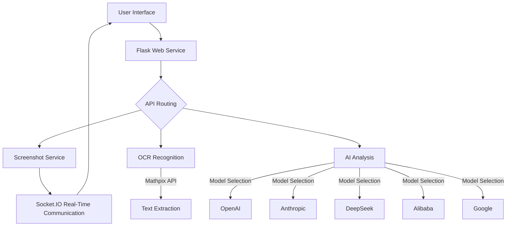

> **Note**: This project is a fork of [Snap-Solver by Zippland](https://github.com/Zippland/Snap-Solver). Please visit the original repository for the source project.

<h1 align="center">Snap-Solver-Plus </h1>

<p align="center">
  <a href="readms/CHINESE.md">Switch to Chinese / 切换到中文</a>
</p>

<p align="center">
  <b>🔍 One-Click Screenshot, Auto-Solve - Online Exams Made Effortless</b>
</p>

## 🆕 Enhancements in This Fork

- **Codebase Optimization**: Streamlined both backend and frontend architectures, achieving an average reduction of 80% in code lines, significantly enhancing application performance and reducing load times.
- **Multilingual Support**: Implemented multilingual functionality for the web user interface, including automatic language switching for the AI, improving accessibility and user experience across diverse linguistic regions.
- **Enhanced Screenshot Functionality**: Introduced an advanced feature allowing users to directly paste images as an alternative to capturing screenshots via the website, simplifying the user workflow.

<p align="center">
  
  
  
  
</p>

<p align="center">
  <a href="#-core-features">Core Features</a> •
  <a href="#-quick-start">Quick Start</a> •
  <a href="#-usage-guide">Usage Guide</a> •
  <a href="#-technical-architecture">Technical Architecture</a> •
  <a href="#-advanced-configuration">Advanced Configuration</a> •
  <a href="#-faq">FAQ</a> •
  <a href="#-get-help">Get Help</a>
</p>

<div align="center">
  <a href="https://github.com/Zippland/Snap-Solver/releases">
    
  </a>
      
  <a href="mailto:zylanjian@outlook.com">
    
  </a>
</div>

<!-- <p align="center">
  
</p> -->

## 💫 Project Overview

**Snap-Solver** is a revolutionary AI-powered exam and study tool designed for students, test-takers, and self-learners. Simply **press a hotkey** to automatically capture any question on your screen, and let AI analyze and provide detailed solutions.

Whether it's complex math equations, physics problems, coding challenges, or other academic subjects, Snap-Solver delivers clear, accurate, and structured solutions to help you understand and master key concepts.

## 🔧 Technical Architecture



## ✨ Core Features

<table>
  <tr>
    <td width="50%">
      <h3>📱 Cross-Device Collaboration</h3>
      <ul>
        <li><b>One-Click Screenshot</b>: Press a hotkey to view and analyze your computer screen on mobile devices</li>
        <li><b>LAN Sharing</b>: Deploy once, access from multiple devices, boosting study efficiency</li>
      </ul>
    </td>
    <td width="50%">
      <h3>🧠 Multi-Model AI Support</h3>
      <ul>
        <li><b>GPT-4o/o3-mini</b>: OpenAI's powerful reasoning capabilities</li>
        <li><b>Claude-3.7</b>: Anthropic's advanced comprehension and explanation</li>
        <li><b>DeepSeek-v3/r1</b>: Optimized for Chinese-language scenarios</li>
        <li><b>QVQ-MAX/Qwen-VL-MAX</b>: Chinese AI renowned for visual reasoning</li>
        <li><b>Gemini-2.5-Pro/2.0-flash</b>: Non-reasoning AI with IQ 130</li>
      </ul>
    </td>
  </tr>
  <tr>
    <td>
      <h3>🔍 Accurate Recognition</h3>
      <ul>
        <li><b>OCR Text Recognition</b>: Accurately captures text from images</li>
        <li><b>Math Formula Support</b>: Precisely recognizes complex mathematical symbols via Mathpix</li>
      </ul>
    </td>
    <td>
      <h3>🌐 Global Accessibility</h3>
      <ul>
        <li><b>VPN Proxy Support</b>: Custom proxy settings to bypass network restrictions</li>
        <li><b>Multilingual Responses</b>: Customize AI response language</li>
      </ul>
    </td>
  </tr>
  <tr>
    <td>
      <h3>💻 Cross-Platform Compatibility</h3>
      <ul>
        <li><b>Desktop Support</b>: Windows, macOS, Linux</li>
        <li><b>Mobile Access</b>: Use directly via browser on phones and tablets</li>
      </ul>
    </td>
    <td>
      <h3>⚙️ Highly Customizable</h3>
      <ul>
        <li><b>Reasoning Depth Control</b>: Adjust AI analysis depth</li>
        <li><b>Custom Prompts</b>: Optimize prompts for specific subjects</li>
      </ul>
    </td>
  </tr>
</table>

## 🚀 Quick Start

### 📋 Prerequisites

- Python 3.x
- At least one of the following API Keys:
  - OpenAI API Key
  - Anthropic API Key (Recommended ✅)
  - DeepSeek API Key
  - Alibaba API Key (Preferred for domestic users)
  - Google API Key
  - Mathpix API Key (Recommended for OCR ✅)

### 📥 Getting Started

```bash
# Install dependencies
pip install -r requirements.txt

# Start the application
python app.py
```

### 📱 Access Methods

- **Local Access**: Open a browser and visit http://localhost:5000
- **LAN Device Access**: Access `http://[Computer-IP]:5000` from any device on the same network

## 📖 Usage Guide

<table>
  <tr>
    <td width="33%">
      <h4>1️⃣ Initial Setup</h4>
      <p>Click the ⚙️ settings icon in the top-right to configure API keys and preferences</p>
    </td>
    <td width="33%">
      <h4>2️⃣ Screenshot & Solve</h4>
      <p>Click the "Screenshot" button → Crop the question area → Select analysis method</p>
    </td>
    <td width="33%">
      <h4>3️⃣ View Solutions</h4>
      <p>View AI analysis and detailed solutions in real-time, including reasoning steps</p>
    </td>
  </tr>
</table>

### 🎯 Example Use Cases

- **Homework**: Capture difficult textbook or assignment questions for step-by-step solutions
- **Code Debugging**: Screenshot error messages to get fix suggestions
- **Exam Review**: Analyze mistakes and understand problem-solving approaches
- **Research**: Capture complex paper excerpts for simplified explanations

### 🧩 Component Details

- **Frontend**: Responsive HTML/CSS/JS interface, mobile-friendly
- **Backend**: Flask + SocketIO, providing RESTful API and WebSocket
- **AI Interface**: Multi-model support with unified interface standards
- **Image Processing**: Efficient screenshot and cropping functionality

## ⚙️ Advanced Configuration

### Model Selection & Optimization

| Model | Advantages | Use Cases |
|-------|------------|-----------|
| **GPT-4o** | Multimodal support | Simple problems, visual analysis |
| **o3-mini** | Reasoning support | Complex problems |
| **Claude-3.7** | Multimodal & reasoning support | Complex problems, visual analysis |
| **DeepSeek-R1** | Reasoning support | Complex problems |
| **DeepSeek-V3** | - | Simple problems |
| **QVQ-MAX** | Multimodal & reasoning support | Complex problems, visual analysis |
| **Qwen-VL-MAX** | Multimodal support | Simple problems, visual analysis |
| **Gemini-2.5-Pro** | Multimodal support | Complex problems, visual analysis |
| **Gemini-2.0-Flash** | Multimodal support | Simple problems, visual analysis |

### 🛠️ Adjustable Parameters

- **Temperature**: Adjust creativity vs. determinism (0.1–1.0)
- **Max Output Tokens**: Control response length
- **Reasoning Depth**: Standard (fast) or deep thinking (detailed)
- **Reasoning Budget Ratio**: Balance between reasoning process and final answer detail
- **System Prompt**: Customize AI behavior and domain expertise

## ❓ FAQ

<details>
<summary><b>How to achieve the best recognition results?</b></summary>
<p>
Ensure screenshots are clear and include the full question and necessary context. For math formulas, use Mathpix OCR for more accurate recognition.
</p>
</details>

<details>
<summary><b>What if I can't connect to the service?</b></summary>
<p>
1. Check firewall settings to allow port 5000<br>
2. Ensure devices are on the same LAN<br>
3. Try restarting the application<br>
4. Check console logs for error details
</p>
</details>

<details>
<summary><b>Why do API calls fail?</b></summary>
<p>
1. API key may be invalid or out of credits<br>
2. Network issues, especially with international APIs<br>
3. Incorrect proxy settings<br>
4. API service may be temporarily unavailable
</p>
</details>

<details>
<summary><b>How to improve AI response quality?</b></summary>
<p>
1. Adjust system prompts with subject-specific guidance<br>
2. Choose models based on question complexity<br>
3. Use "deep thinking" mode for complex questions<br>
4. Ensure screenshots include complete information
</p>
</details>

## 🤝 Get Help

- **Deployment Service**: If you're not tech-savvy and need deployment assistance, contact [zylanjian@outlook.com](mailto:zylanjian@outlook.com)
- **Issue Reporting**: Submit issues on the GitHub repository
- **Feature Suggestions**: Share ideas via Issues or email

## 📜 Open Source License

This project is licensed under the [Apache 2.0](LICENSE) license.
