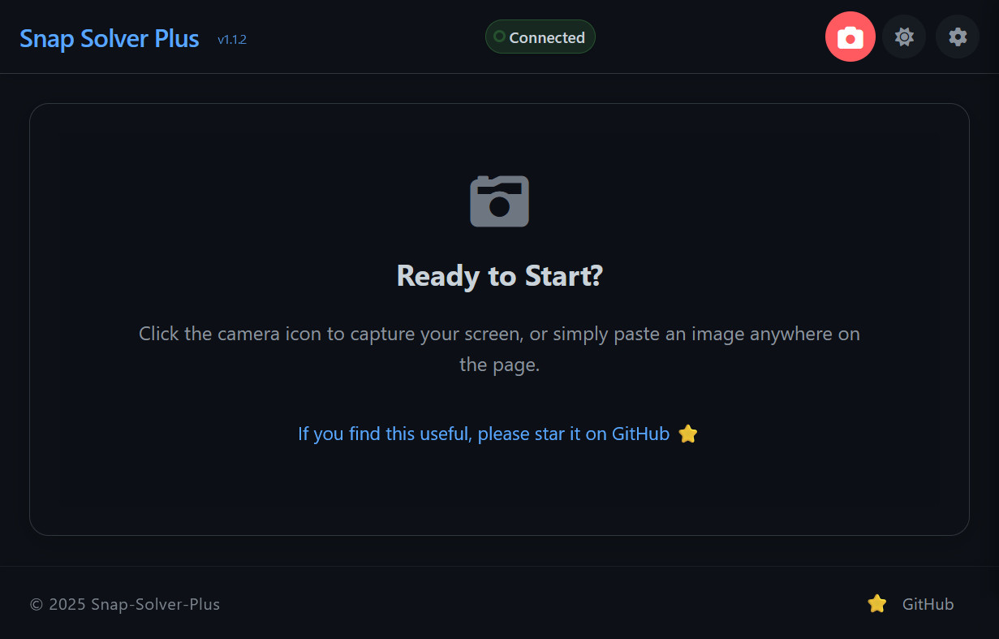
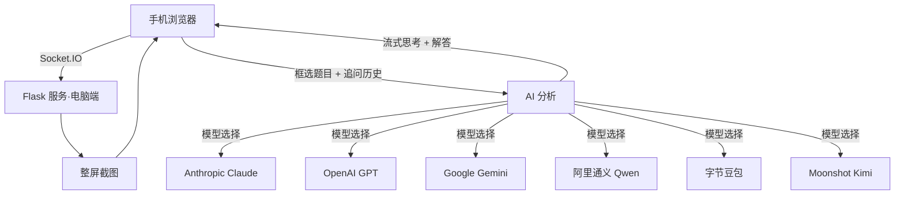

<h1 align="center">Snap-Solver </h1>


<p align="center">
  <b>🔍 一键截屏，自动解题 - 线上考试，从未如此简单</b>
</p>

<p align="center">
  
  
  
  
</p>


<p align="center">
  <a href="#-核心特性">核心特性</a> •
  <a href="#-快速开始">快速开始</a> •
  <a href="#-新手教程">新手教程</a> •
  <a href="#-使用流程">使用流程</a> •
  <a href="#-技术架构">技术架构</a> •
  <a href="#-可调项">可调项</a> •
  <a href="#-常见问题">常见问题</a> •
  <a href="#-获取帮助">获取帮助</a>
</p>

<div align="center">
  <a href="https://github.com/Zippland/Snap-Solver/releases">
    
  </a>
  &nbsp;&nbsp;&nbsp;&nbsp;
  <a href="docs/beginner-tutorial.md">
    
  </a>
  &nbsp;&nbsp;&nbsp;&nbsp;
  <a href="mailto:zylanjian@outlook.com">
    
  </a>
</div>
<!-- <p align="center">
  
</p> -->

## 💫 项目简介

**Snap-Solver** 是一个自部署的 AI 解题工具，专为学生、考生和自学者设计。在电脑上运行它，手机浏览器打开页面，**点一下**即可截取电脑的整个屏幕、在手机上框选题目，AI 流式给出详细解答；看不懂还可以**就这道题继续追问**。

无论是复杂的数学公式、物理难题、编程问题，还是其他学科的挑战，Snap-Solver 都能提供清晰、准确、有条理的解决方案。自带密钥（BYO-Key），全部数据只在你的电脑和局域网内流转。

## 📚 新手教程

第一次使用？按照我们的 [《新手教程》](docs/beginner-tutorial.md) 完成环境准备、模型配置和首次解题演练，全程图文指引，几分钟即可上手。

## 🔧 技术架构


```mermaid
graph TD
    A[手机浏览器] --> |Socket.IO| B[Flask 服务·电脑端]
    B --> C[整屏截图]
    C --> A
    A --> |框选题目 + 追问历史| D[AI 分析]
    D --> |模型选择| H1[Anthropic Claude]
    D --> |模型选择| H2[OpenAI GPT]
    D --> |模型选择| H3[Google Gemini]
    D --> |模型选择| H4[阿里通义 Qwen]
    D --> |模型选择| H5[字节豆包]
    D --> |模型选择| H6[Moonshot Kimi]
    D --> |流式思考 + 解答| A
```

## ✨ 核心特性

<table>
  <tr>
    <td width="50%">
      <h3>📱 手机遥控电脑截屏</h3>
      <ul>
        <li><b>一键截屏</b>：手机上点一下，电脑自动截取整个屏幕回传</li>
        <li><b>手机框选</b>：在手机上缩放、框选题目区域，只发关键部分</li>
        <li><b>局域网直连</b>：一处部署，同网多设备访问</li>
      </ul>
    </td>
    <td width="50%">
      <h3>🧠 六家模型自由切换</h3>
      <ul>
        <li><b>Claude 家族</b>（Anthropic）：Opus / Sonnet / Haiku</li>
        <li><b>GPT 家族</b>（OpenAI）：GPT-5.6 系列</li>
        <li><b>Gemini 家族</b>（Google）：3.x / 2.5 系列</li>
        <li><b>通义家族</b>（阿里）：Qwen3-VL / QVQ，国内直连</li>
        <li><b>豆包</b>（字节）与 <b>Kimi</b>（Moonshot）：国内直连</li>
      </ul>
    </td>
  </tr>
  <tr>
    <td>
      <h3>💬 流式解答 + 同题追问</h3>
      <ul>
        <li><b>思考过程可见</b>：推理模型的思考流实时展开，结束自动收起</li>
        <li><b>同题追问</b>：答案没看懂？围绕本题继续问，换题即清空</li>
        <li><b>Markdown 渲染</b>：公式、代码块（带一键复制）清晰呈现</li>
      </ul>
    </td>
    <td>
      <h3>🔒 隐私与网络</h3>
      <ul>
        <li><b>自带密钥</b>：API Key 只存在你电脑的 <code>.snapsolver/</code> 目录，不经过任何第三方</li>
        <li><b>代理与中转</b>：支持 HTTP 代理和各厂商中转 API 地址</li>
        <li><b>多语言响应</b>：可定制 AI 回复语言</li>
      </ul>
    </td>
  </tr>
  <tr>
    <td>
      <h3>💻 全平台兼容</h3>
      <ul>
        <li><b>桌面支持</b>：Windows、MacOS、Linux</li>
        <li><b>移动访问</b>：手机、平板通过浏览器直接使用，无需装 App</li>
      </ul>
    </td>
    <td>
      <h3>⚙️ 高度可定制</h3>
      <ul>
        <li><b>推理档位</b>：Fast / High / Max 三档全局统一，按模型能力自动适配</li>
        <li><b>自定义提示词</b>：内置模式之外可自建学科专属提示词</li>
      </ul>
    </td>
  </tr>
</table>

## 🚀 快速开始

### 📋 前置要求

- Python 3.x
- 至少以下一个 API Key（在网页设置里填写，只存本机）:
  - Anthropic API Key (推荐✅)
  - OpenAI API Key
  - Google API Key
  - 阿里通义 API Key（国内直连✅）
  - 字节豆包 API Key（国内直连）
  - Moonshot Kimi API Key（国内直连）

### 📥 开始使用

```bash
# 安装依赖（首次）
pip install -r requirements.txt

# 启动应用
python app.py
```

### 📱 访问方式

- **手机访问（推荐）**：手机与电脑连同一 Wi-Fi，浏览器打开 `http://[电脑IP]:5000`（启动时终端会打印这个地址；5000 被占用时自动改用 5001）
- **本机访问**：浏览器打开 http://localhost:5000

## 📖 使用流程

1. 电脑上把题目显示在屏幕上，手机上点 **截屏解题**
2. 电脑整屏截图回传手机，**双指缩放、框选**题目区域
3. 发送后 AI 流式解答：思考过程以淡色小字实时展开，结束自动收起，正文 Markdown 渲染
4. 看不懂？在答案底部的输入框**就这道题继续追问**（上下文=题图+已有问答，换题或返回即清空）
5. 需要换个角度：**重解 / 换模型重解 / 复制** 一键可达

### 🎯 使用场景示例

- **课后习题**：截取教材或作业中的难题，获取步骤详解
- **编程调试**：截取代码错误信息，获取修复建议
- **考试复习**：分析错题并理解解题思路
- **文献研究**：截取复杂论文段落，获取简化解释

### 🧩 组件详情

- **前端**：原生 HTML/CSS/JS，移动优先，明暗双主题（可跟随系统）
- **后端**：Flask + Socket.IO 实时通信，无状态设计（追问历史由前端持有）
- **AI 接口**：六家厂商统一接入，推理档位与思考流跨厂商归一
- **本地数据**：密钥、代理配置、自建提示词等运行期文件统一存放在项目根目录 `.snapsolver/`（已被 git 忽略）

## ⚙️ 可调项

- **推理档位**：Fast / High / Max 全局三档，切换模型时按其能力自动钳制
- **提示词模式**：内置「标准解题」等模式，也可自建学科专属提示词
- **回复语言**：定制 AI 的回答语言
- **HTTP 代理**：为国际 API 配置本地代理（如 Clash 的 127.0.0.1:7890）
- **中转 API 地址**：各厂商可分别填写中转地址，填了即走中转

## ❓ 常见问题

<details>
<summary><b>如何获得最佳识别效果？</b></summary>
<p>
框选时包含完整题目和必要上下文（图、选项、已知条件）。所有内置模型都直接识图，无需 OCR；数学公式较多时建议把推理档位调到 High 或 Max。
</p>
</details>

<details>
<summary><b>无法连接到服务怎么办？</b></summary>
<p>
1. 检查防火墙是否放行 5000 端口（被占用时程序会自动改用 5001，以启动时终端打印的地址为准）<br>
2. 确认手机与电脑在同一局域网内<br>
3. 尝试重启应用程序<br>
4. 查看终端日志获取错误信息
</p>
</details>

<details>
<summary><b>API调用失败的原因？</b></summary>
<p>
1. API密钥可能无效或余额不足<br>
2. 网络连接问题，特别是国际API<br>
3. 代理设置不正确<br>
4. API服务可能临时不可用
</p>
</details>

<details>
<summary><b>如何优化AI回答质量？</b></summary>
<p>
1. 自建提示词模式，添加特定学科的指导<br>
2. 根据问题复杂度选择合适的模型<br>
3. 复杂题目把推理档位调到 High / Max，或对答案直接追问<br>
4. 确保框选的题目包含完整信息
</p>
</details>

## 🤝 获取帮助

- **代部署服务**：如果您不擅长编程，需要代部署服务，请联系 [zylanjian@outlook.com](mailto:zylanjian@outlook.com)
- **问题报告**：在GitHub仓库提交Issue
- **功能建议**：欢迎通过Issue或邮件提供改进建议

## 📜 开源协议

本项目采用 [Apache 2.0](LICENSE) 协议。
