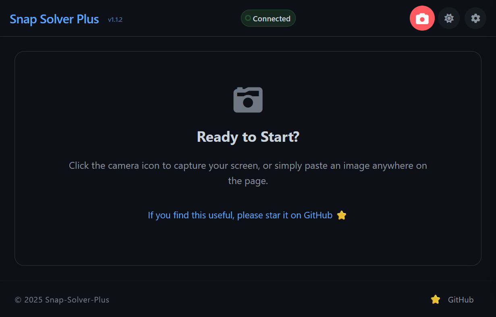

English | [中文](README.md)

# 📚 Snap-Solver - AI Exam Assistance Tool

> 🔍 One-click recognition, automatic solving

## ✨ Project Introduction

Snap-Solver is a powerful AI exam assistance tool that can automatically capture questions on your computer screen with just a **press of a hotkey**, recognize them through AI, and provide detailed solutions. Whether it's mathematics, physics, chemistry, programming problems, or other academic questions, Snap-Solver can provide professional answers.

> For **deployment services**, please contact: [zylanjian@outlook.com](mailto:zylanjian@outlook.com)



## 🌟 Core Features

- 🖼️ **One-click Screenshot**: Use a hotkey (Alt+Ctrl+S, customizable) to remotely monitor your computer screen
- 🌐 **LAN Sharing**: Deploy once, use everywhere — all devices on the same network can access
- 🔍 **OCR Text Recognition**: Support for Mathpix API to recognize mathematical formulas and text in images
- 🧠 **Multiple Model Support**: Simultaneous support for GPT-4o, Claude-3.7, DeepSeek, and other AI models
- 🔐 **VPN Proxy Support**: Customizable VPN proxy, supports users in regions with limited access to AI models
- 🌓 **Theme Switching**: Light and dark theme support to protect your eyes
- 💻 **Cross-Platform Support**: Works on Windows, MacOS, Linux, with mobile access through browsers

## 🛠️ Technical Architecture

- **Backend**: Flask + SocketIO, providing Web services and WebSocket real-time communication
- **Frontend**: HTML + CSS + JavaScript, providing an intuitive user interface
- **AI Interfaces**:
  - GPT-4o: OpenAI's image and text understanding model (without reasoning)
  - Claude-3.7: Anthropic's advanced thinking model (includes reasoning by default)
  - DeepSeek: Alternative model support
  - Mathpix: Professional mathematical formula and text recognition service

## 📋 Prerequisites

1. **API Keys**: 
   - [OpenAI API Key](https://openai.com) (for GPT-4o)
   - [Anthropic API Key](https://anthropic.com) (for Claude-3.7, optional)
   - [Mathpix API Key](https://mathpix.com) (for OCR text recognition, optional)

2. **Running Environment**:
   - [Python](https://www.python.org/downloads/) 3.x version
   - Required Python dependencies

## 🚀 Quick Start

1. **Clone the project**:
   ```bash
   git clone https://github.com/zippland/Snap-Solver.git
   ```

2. **Activate virtual environment**:
   ```bash
    .venv/Scripts/activate
   ```

3. **Install dependencies**:
   ```bash
   pip install -r requirements.txt
   ```

4. **Start the application**:
   ```bash
   python app.py
   ```

5. **Access the service**:
   - Local access: Open browser, visit http://localhost:5000
   - Mobile device access: Use phones/tablets on the same LAN to visit http://[server-IP]:5000

## 💡 Usage Guide

### 1. First-time Setup

When using for the first time, click the ⚙️ settings icon in the top right corner to configure:
- AI model API keys (at least one required)
- OCR recognition settings (optional)
- Proxy settings (if needed)
- System prompt (customizable)

### 2. Screenshot-based Problem Solving

1. Press the `Screenshot` button on your phone or tablet
2. Your computer screen will automatically display on your mobile device
3. Crop the problem area you want to solve on your mobile device
4. Choose "Send image to AI" (direct image analysis) or "Extract text from image" (OCR then analysis)
5. Wait for the system to process and view the detailed solution

### 3. Text-based Problem Solving

If you already have the problem text, or want to modify the recognized text:
1. Use the "Extract text from image" feature
2. Edit the content in the text box
3. Click "Send text to AI" to get the solution

## ⚙️ Advanced Configuration

You can customize multiple parameters in the settings panel:

- **AI Model**: Choose different AI models (GPT-4o, Claude-3.7, DeepSeek, etc.)
- **Language**: Set the preferred language for AI responses
- **Temperature**: Adjust the randomness of AI responses (lower values are more precise, higher values more creative)
- **System Prompt**: Customize basic instructional prompts for the AI
- **Proxy Settings**: Configure HTTP proxy for users in regions with limited access

## 📞 Get Help

- For bug issues: Please submit an Issue in this repository
- For **deployment help**, contact: [zylanjian@outlook.com](mailto:zylanjian@outlook.com)

## 🔧 Common Issues

### 1. Screenshot function not responding?
- Ensure the application is run with administrator privileges
- Check if screen recording permissions have been granted
- Confirm that the Python process is running

### 2. Cannot connect to the service?
- Check firewall settings
- Confirm mobile devices are on the same network as the computer
- Verify the server IP address is correct

### 3. API call failed?
- Check if API Keys are correctly set
- Confirm network connection is normal
- If using a proxy, check if proxy settings are correct

## 🔐 Security Tips

- Your API keys are stored locally and not uploaded to any server
- Only use this service on trusted local networks
- Regularly update the system and dependencies to ensure security

## 🤝 Contribution

Welcome to submit Issues and Pull Requests!

1. Fork this repository
2. Create a feature branch (`git checkout -b feature/AmazingFeature`)
3. Commit your changes (`git commit -m 'Add some AmazingFeature'`)
4. Push to the branch (`git push origin feature/AmazingFeature`)
5. Submit a Pull Request

## 📜 License

This project is licensed under the [Apache](LICENSE) license.

---

⭐ If this project helps you, please give it a Star! Thanks for your support! 