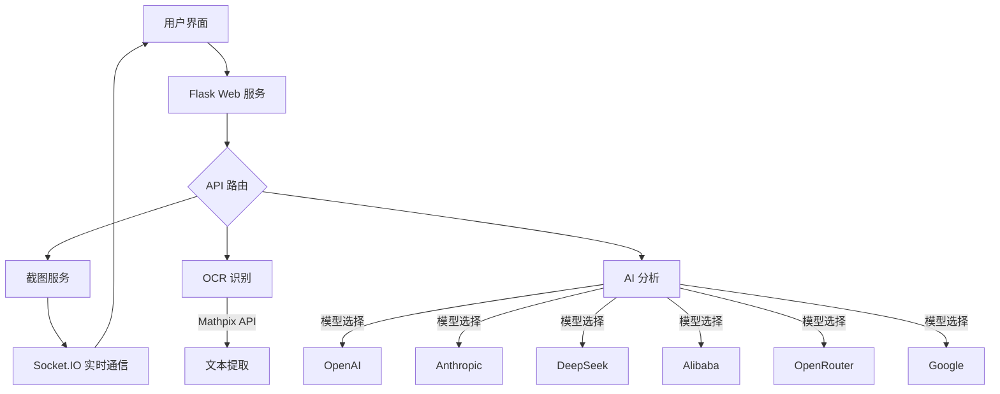

> **注意**：本项目是 [Snap-Solver by Zippland](https://github.com/Zippland/Snap-Solver) 的分叉。请访问原始仓库以获取源项目。

<h1 align="center">Snap-Solver-Plus </h1>

<p align="center">
  <a href="README.md">Switch to English / 切换到英文</a>
</p>

<p align="center">
  <b>🔍 一键截图，自动解答 - 在线考试轻松无忧</b>
</p>

## 🆕 本分叉的增强功能

- **代码库优化**：优化后端和前端架构，平均减少80%的代码量，大幅提升应用性能和加载速度。
- **多语言支持**：网页界面集成多语言功能，AI自动切换语言，提升全球用户的可访问性和体验。
- **高级截图功能**：新增直接粘贴图片功能，作为网站截图的替代方式，简化操作流程。
- **一键自动更新**：引入无缝自动更新功能，提升用户体验。

<p align="center">
  
  
  
  
</p>

<p align="center">
  <a href="#-核心功能">核心功能</a> •
  <a href="#-快速入门">快速入门</a> •
  <a href="#-使用指南">使用指南</a> •
  <a href="#-技术架构">技术架构</a> •
  <a href="#-高级配置">高级配置</a> •
  <a href="#-常见问题">常见问题</a> •
  <a href="#-获取帮助">获取帮助</a>
</p>

<div align="center">
  <a href="https://github.com/KHROTU/Snap-Solver-Plus/releases">
    
  </a>
      
  <a href="mailto:3o65iduqd@mozmail.com">
    
  </a>
</div>

 <p align="center">
   
 </p>

## 💫 项目概述

**Snap-Solver-Plus** 是一款革命性的AI驱动考试和学习工具，专为学生、考试考生和自学者设计。只需**按下截图按钮**或**粘贴图片**，即可自动捕获屏幕上的任何问题，让AI分析并提供详细解决方案。

无论是复杂的数学方程、物理问题、编程挑战还是其他学术科目，Snap-Solver 提供清晰、准确且结构化的解决方案，帮助用户理解和掌握关键概念。

## 🔧 技术架构



## ✨ 核心功能

<table>
  <tr>
    <td width="50%">
      <h3>📱 跨设备协作</h3>
      <ul>
        <li><b>一键截图</b>：按快捷键在移动设备上查看和分析电脑屏幕</li>
        <li><b>局域网共享</b>：一次部署，多设备访问，提升学习效率</li>
      </ul>
    </td>
    <td width="50%">
      <h3>🧠 多模型AI支持</h3>
      <ul>
        <li><b>GPT-4o/o3-mini</b>：OpenAI的强大推理能力</li>
        <li><b>Claude 3.7 Sonnet</b>：Anthropic的高级理解和解释能力</li>
        <li><b>DeepSeek-V3/R1</b>：优化中文场景</li>
        <li><b>Qwen 2.5 Max</b>：中国AI，以视觉推理著称</li>
        <li><b>Gemini-2.5-Pro/2.5-Flash</b>：Google的多模态AI，支持100万令牌上下文</li>
      </ul>
    </td>
  </tr>
  <tr>
    <td>
      <h3>🔍 精准识别</h3>
      <ul>
        <li><b>OCR文本识别</b>：准确捕获图片中的文本</li>
        <li><b>数学公式支持</b>：通过Mathpix精准识别复杂数学符号</li>
      </ul>
    </td>
    <td>
      <h3>🌐 全球可访问性</h3>
      <ul>
        <li><b>VPN代理支持</b>：自定义代理设置绕过网络限制</li>
        <li><b>多语言响应</b>：自定义AI响应语言</li>
      </ul>
    </td>
  </tr>
  <tr>
    <td>
      <h3>💻 跨平台兼容性</h3>
      <ul>
        <li><b>桌面支持</b>：Windows、macOS、Linux</li>
        <li><b>移动访问</b>：通过手机和平板浏览器直接使用</li>
      </ul>
    </td>
    <td>
      <h3>⚙️ 高度可定制</h3>
      <ul>
        <li><b>推理深度控制</b>：调整AI分析深度</li>
        <li><b>自定义提示</b>：优化特定学科的提示</li>
      </ul>
    </td>
  </tr>
</table>

## 🚀 快速入门

### 📋 前提条件

- Python 3.x
- 至少需要以下任一API密钥：
  - OpenAI API 密钥
  - Anthropic API 密钥（推荐 ✅）
  - DeepSeek API 密钥
  - Alibaba API 密钥（中国用户首选）
  - OpenRouter API 密钥
  - Google API 密钥
  - Mathpix API 密钥（OCR必需 ✅）

### 📥 开始使用

```bash
# 安装依赖
pip install -r requirements.txt

# 启动应用
python app.py
```

### 📱 访问方法

- **本地访问**：打开浏览器访问 http://localhost:5000
- **局域网设备访问**：在同一网络的任何设备上访问 `http://[电脑IP]:5000`

## 📖 使用指南

<table>
  <tr>
    <td width="33%">
      <h4>1️⃣ 初始设置</h4>
      <p>点击右上角的 ⚙️ 设置图标，配置API密钥和偏好</p>
    </td>
    <td width="33%">
      <h4>2️⃣ 截图与解答</h4>
      <p>点击“截图”按钮 → 裁剪问题区域 → 选择分析方法</p>
    </td>
    <td width="33%">
      <h4>3️⃣ 查看解决方案</h4>
      <p>实时查看AI分析和详细解决方案，包括推理步骤</p>
    </td>
  </tr>
</table>

### 🎯 示例用例

- **作业**：捕获教材或作业中的难题，获取分步解决方案
- **代码调试**：截图错误消息，获取修复建议
- **考试复习**：分析错误，理解解题方法
- **研究**：捕获复杂论文片段，获取简化解释

### 🧩 组件详情

- **前端**：响应式HTML/CSS/JS界面，适配移动设备
- **后端**：Flask + SocketIO，提供RESTful API和WebSocket
- **AI接口**：多模型支持，统一接口标准
- **图像处理**：高效的截图和裁剪功能

## ⚙️ 高级配置

### 模型选择与优化

| 模型                | 优势                                   | 用例                              |
|---------------------|---------------------------------------|-----------------------------------|
| **GPT-4o**          | 多模态（文本、图像），快速处理         | 聊天、文本摘要、图像分析          |
| **o4-mini**         | 高级推理，成本效益高                   | 复杂推理、STEM任务               |
| **Claude 3.7 Sonnet**| 混合推理，透明过程                    | 编码、网页开发、推理             |
| **Claude 3.7 Opus** | 增强推理，多模态                      | 复杂编码、长篇任务               |
| **DeepSeek-R1**     | 开源，强大的数学和编码能力             | 数学、竞赛编码、成本敏感项目     |
| **DeepSeek-V3**     | 高效，高数学性能                      | 数学、逻辑、一般任务             |
| **Qwen 2.5 Max**    | 多模态，代码和多语言支持              | 代码生成、多语言任务、图像分析   |
| **Qwen 2.5 VL**     | 视觉-语言，多模态处理                 | 图像分析、简单多模态任务         |
| **Gemini 2.5 Pro**  | 大型100万令牌上下文，多模态            | 编码、推理、大数据集分析         |
| **Gemini 2.5 Flash**| 快速、成本效益高，多模态               | 快速任务、多模态处理             |

### 🛠️ 可调整参数

- **温度**：调整创造性与确定性（0.1–1.0）
- **最大输出令牌**：控制响应长度
- **推理深度**：标准（快速）或深度思考（详细）
- **推理预算比例**：平衡推理过程与最终答案细节
- **系统提示**：自定义AI行为和领域专长

## ❓ 常见问题

<details>
<summary><b>如何获得最佳识别结果？</b></summary>
<p>
确保截图清晰，包含完整问题和必要上下文。对于数学公式，使用Mathpix OCR以获得更准确的识别。
</p>
</details>

<details>
<summary><b>无法连接到服务怎么办？</b></summary>
<p>
1. 检查防火墙设置，允许端口5000<br>
2. 确保设备在同一局域网<br>
3. 尝试重启应用<br>
4. 检查控制台日志以获取错误详情
</p>
</details>

<details>
<summary><b>为什么API调用失败？</b></summary>
<p>
1. API密钥可能无效或余额不足<br>
2. 网络问题，特别是国际API<br>
3. 代理设置错误<br>
4. API服务可能暂时不可用
</p>
</details>

<details>
<summary><b>如何提高AI响应质量？</b></summary>
<p>
1. 使用特定学科的指导调整系统提示<br>
2. 根据问题复杂性选择模型<br>
3. 对复杂问题使用“深度思考”模式<br>
4. 确保截图包含完整信息
</p>
</details>

## 🤝 获取帮助

- **部署服务**：如果您不熟悉技术并需要部署帮助，请联系 [3o65iduqd@mozmail.com](mailto:3o65iduqd@mozmail.com)
- **问题报告**：在GitHub仓库提交问题
- **功能建议**：通过Issues或电子邮件分享想法

## 📜 开源许可证

本项目采用 [Apache 2.0](LICENSE) 许可证。
